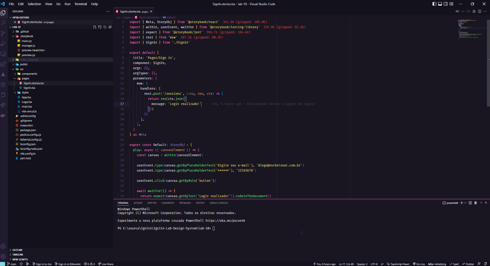
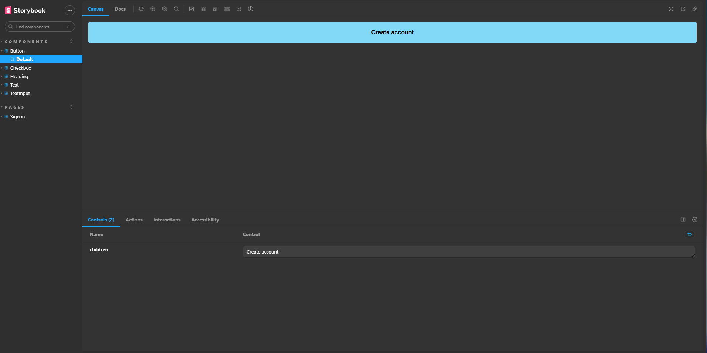

<h1 align="center">Ignite Lab Design System</h1>

<p align="center">
  <a href="#-tecnologias-e-bibliotecas">Tecnologias e Bibliotecas</a>&nbsp;&nbsp;&nbsp;|&nbsp;&nbsp;&nbsp;
  <a href="#-projeto">Projeto</a>&nbsp;&nbsp;&nbsp;|&nbsp;&nbsp;&nbsp;
  <a href="#-como-executar">Como executar</a>&nbsp;&nbsp;&nbsp;|&nbsp;&nbsp;&nbsp;
  <a href="#-saiba-mais">Saiba mais</a>&nbsp;&nbsp;&nbsp;|&nbsp;&nbsp;&nbsp;
  <a href="#-licença">Licença</a>
</p>

<p align="center">
  

</p>





## ✨ Tecnologias e Bibliotecas

Esse projeto foi desenvolvido com as seguintes tecnologias e Bibliotecas:

* <a href="https://reactjs.org"> React </a>
* <a href="https://www.typescriptlang.org"> Typescript </a>
* <a href="https://vitejs.dev"> Vite </a>
* <a href="https://tailwindcss.com"> Tailwind </a>
* <a href="https://storybook.js.org"> Storybook </a>
* <a href="https://axios-http.com"> Axios </a>
* <a href="https://mswjs.io"> Msw </a>

## 💻 Projeto

O Ignite Lab Design System foi um projeto desenvolvido no evento Ignite Lab 03 da Rocketseat. Consistiu em construir uma tela de login no figma e depois construir um storybook com os componentes.

## 🚀 Como executar

Para executar o storybook:

```bash
# Abra um terminal e copie este repositório com o comando
git clone https://github.com/lhfam97/ignite-lab-design-system/
# ou use a opção de download.

# Entre na pasta da aplicação 

# Instale as dependências
yarn install

# Rode a aplicação
yarn storybook

```

Para executar os testes do storybook:

```bash
# Abra um novo terminal e execute

yarn test-storybook

```


<br>

## :memo: Licença

Esse projeto está sob a licença MIT. Veja o arquivo [LICENSE](/LICENSE) para mais detalhes.

---

Feito com :purple_heart: by [Luís Machado](https://github.com/lhfam97)

[](https://www.linkedin.com/in/luís-henrique-machado-98037a127/) 
[](mailto:lhfam97@gmail.com)
